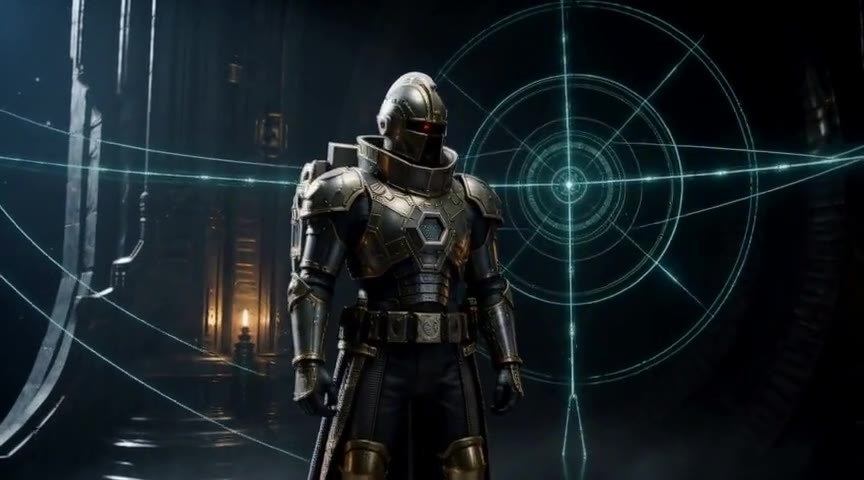
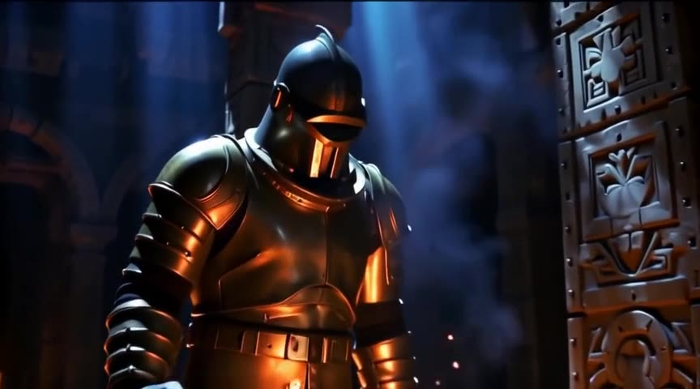
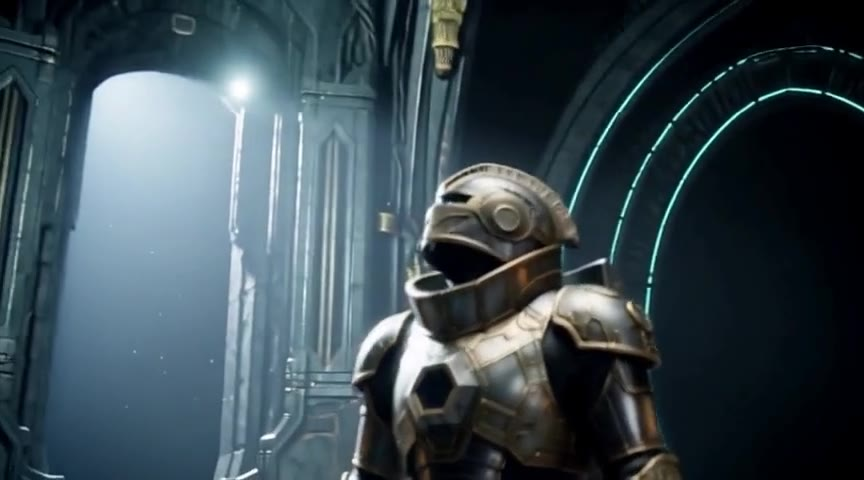

# R9700 local AI performance lab

Reproducible workflows, measurements, and engineering records for AI workloads on an AMD Radeon AI PRO R9700. The repository is deliberately numbers-first: it records absolute wall time, exact workload shape, software/model provenance, failed hypotheses, and the evidence behind production selections. Scope is local AI performance on this card — image and video generation, audio generation, and local LLM inference.

### [→ View the R9700 Generation Lab](https://boxwrench.github.io/R9700/)

The generation field report: H3 text-to-video, image-to-video and reference-to-video; LTX 2.5 text-to-video, image-to-video and video-to-video; last-frame continuation to ~14 s; a 30-second Music 3 track; and the known-good session that switched between all of them without rebuilding the machine. Every clip carries its measured wall time and its full prompt.

> **Something is slow or weird?** Start with [`TROUBLESHOOTING.md`](TROUBLESHOOTING.md). It maps observed symptoms to the first discriminator to run before you reinstall, requantize, or start tuning kernels.
>
> **Setting up the known-good configuration?** Use [`docs/selected-production-configs.md`](docs/selected-production-configs.md).
>
> **AI agent?** Read [`AGENTS.md`](AGENTS.md) first. Do not silently replace selected configurations with newer upstream defaults.

## Headline findings

These are measured improvements on this R9700 system, not generic AMD marketing claims. The workloads and timing boundaries differ, so the rows should not be multiplied together or treated as one universal speedup.

| Problem / workload | Unoptimized or pathological path measured here | Selected / corrected path | Result |
|---|---:|---:|---:|
| H3 Qwen3-VL model load, mmap-backed | 931 s | 1.2 s with `--disable-mmap` | **~776x faster load** |
| H3 full warm-up path | 1,362 s | 51.07 s with mmap disabled | **~27x faster warm-up** |
| LTX short 768x448 / 41-frame / 8-step workload | 43.78 s wall | 25.69 s wall | **41% less wall time / ~1.70x throughput** |
| H3 paired changed-prompt T2V | 44.95 s wall | 41.30 s with Qwen pre-sampler offload | **8.1% less wall time** |
| H3 sampler inside that paired A/B | 29.51 s | 22.15 s | **24.9% faster sampling** |
| MiniMax Music 3 | ~24.42 s warm wall | AR bottleneck characterized | **FixedKV/compile evaluated and closed** |

The spectacular mmap numbers are **model-loading fixes**, not generation speedups. Once models are warm, they do not compound with the recurring LTX/H3 improvements.

The other value of this repository is avoiding dead ends. This work has already ruled out or scoped several tempting paths: storage/PCIe tuning for the mmap pathology, BF16 LTX encoder as a speed fix, generic H3 dual-GPU residency as the default, unreliable `rocm-smi` utilization conclusions on gfx1201, H3 kernel tuning before encoder residency, Music DiT tuning while conditioning dominates, ComfyUI's NVIDIA-only FixedKV Music graph path, and naive `torch.compile` on Music's dynamic Qwen KV-cache loop.

## What currently works

| Workload | Status | Selected path |
|---|---|---|
| H3 T2V / I2V / R2V | **Production** | FP8 + pre-sampler Qwen offload |
| LTX 2.5 T2V / I2V / V2V | **Production** | INT8-ConvRot + Gemma floor 256 |
| MiniMax Music 3 | **Production** | AR bottleneck characterized |
| H3 continuation | Demonstrated | last-frame continuation |
| LTX continuation | Demonstrated | last-frame continuation |
| Qwen3.8-27B | Selected | Q4_K_XL + MTP |
| DeepSeek V4 Flash | Validated | 32K Q8 KV profile |

Verify the live system against the machine-checkable manifest at any time:

```bash
python3 scripts/production-preflight.py
```

## Generation showcase

<table>
<tr>
<td><a href="https://boxwrench.github.io/R9700/"></a><br><sub>H3 R2V — image + voice reference</sub></td>
<td><a href="https://boxwrench.github.io/R9700/"></a><br><sub>LTX 2.5 T2V — text only</sub></td>
<td><a href="https://boxwrench.github.io/R9700/"></a><br><sub>H3 continuation — 14.55 s</sub></td>
</tr>
</table>

Nine renders at 864×480, 39m 38s of measured generation time on one card.

- **H3 conditioning comparison.** Text-only lands the scene but not the character; first-frame conditioning starts exact and drifts after ~2.5 s; image-plus-voice reference retains identity to the final frame. 465.94 / 513.89 / 561.80 s.
- **LTX conditioning comparison.** Text-only produces a generic knight; an anchor frame pins the character; a source video retains structure and restyles it. 56.04 / 70.90 / 59.37 s.
- **Continuation.** The last frame of a finished clip becomes the first frame of the next. Joins measure ~3/255 against the frame they continue from, so they read as one take. H3 reaches 14.55 s with audio, LTX 13.38 s.
- **Music 3 at 30 s.** The 15-second figure in the benchmark table is a workflow parameter, not a model limit; the latent node accepts up to 360 s. The showcase track is 29.99 s in 50.82 s of wall time.

Per-run records — prompts, seeds, stage timing, identity measurements, and what each run got wrong — are in [`showcase/metadata-v2/`](showcase/metadata-v2/). Slot geometry is in [`showcase/media-spec.md`](showcase/media-spec.md). The page source is [`docs/index.html`](docs/index.html); see [`docs/publishing-video.md`](docs/publishing-video.md) for the Pages and release setup.

## Generation stack — validated 2026-08-18

The video/audio work optimizes practical latency from **"I changed what I want" to a usable artifact**. It favors small decisive experiments over exhaustive benchmarking and separates measured facts from mechanism hypotheses. Index: [ComfyUI wall-time campaign](docs/comfyui-walltime-campaign-20260818.md).

| Workload | Selected behavior |
|---|---|
| LTX 2.5 | `--disable-mmap`, INT8-ConvRot encoder + DiT, `LTX_GEMMA_MIN_LENGTH=256`, `tile_size=1280`, reuse unchanged negative conditioning |
| MiniMax H3 | `--disable-mmap`, single R9700, explicitly offload Qwen3-VL after conditioning and before sampling |
| MiniMax Music 3 | `--disable-mmap`; baseline ~19.8 s AR / ~3.6 s DiT; FixedKV/compile closed |

Exact model filenames, SHA-256 values, runtime versions, launcher, environment, caveats, and reference results are in [`docs/selected-production-configs.md`](docs/selected-production-configs.md) and [`production/manifest.json`](production/manifest.json). Golden workflows are in [`production/workflows/`](production/workflows/), with canaries in [`production/canaries/`](production/canaries/).

**The two largest wins.** On the short 768×448 / 41-frame / 8-step benchmark, reducing the Gemma minimum sequence floor from 1024 to 256 cut conditioning from 22.51 s to 5.35 s and wall from 43.78 s to 25.69 s. This is not pixel-preserving: conditioning stays numerically close but the later diffusion trajectory changes. Separately, in a paired identical-prompt/seed A/B, leaving Qwen3-VL resident produced 29.51 s sampling at 1.476 s/step; unloading it before sampling reduced that to 22.15 s at 1.108 s/step, and the 4.03 s offload still left a net 8.1% wall improvement.

Records: [LTX 2.5](docs/ltx25-r9700-optimization-20260818.md) · [MiniMax H3](docs/minimax-h3-r9700-optimization-20260818.md) · [Music 3 baseline](docs/minimax-music3-r9700-baseline-20260818.md)

### For an AI agent

If the user asks to **set up H3**, **restore the optimized workflow**, **use the fastest current config**, or otherwise reproduce the known-good R9700 state:

1. Treat the selected configurations in [`docs/selected-production-configs.md`](docs/selected-production-configs.md) as authoritative.
2. Do not substitute a newer model, quant, workflow, ComfyUI commit, Torch/ROCm stack, or default merely because it is newer.
3. Verify the exact model filenames before changing anything.
4. Preserve the selected local behavior: LTX Gemma floor `256` and H3 Qwen pre-sampler offload.
5. Consult [`TROUBLESHOOTING.md`](TROUBLESHOOTING.md) before diagnosing a performance problem from scratch.
6. Treat updates as **candidates** until they reproduce the relevant canary. Follow [`docs/update-gate.md`](docs/update-gate.md).
7. If an update would overwrite a selected local modification, report exactly what would be lost before proceeding.

More detailed agent rules live in [`AGENTS.md`](AGENTS.md).

## If you see this, check this first

| Symptom | First check |
|---|---|
| Model load takes many minutes; one CPU core busy; GPU mostly idle | Run with `--disable-mmap`; see [catastrophically slow model loading](TROUBLESHOOTING.md#1-catastrophically-slow-model-loading) |
| H3 changed-prompt sampling is ~25-30 s instead of ~22 s | Check whether Qwen3-VL is still resident before the sampler |
| H3 sampler starts around 26 GiB allocated | Check pre-sampler encoder offload; selected path drops to roughly 7 GiB before DiT staging |
| LTX short prompt spends ~22 s conditioning | Check Gemma minimum sequence floor; selected value is `256` |
| `rocm-smi` says ~0-1% GPU while board power is near 300 W | Do not diagnose CPU fallback from that counter alone |
| MiniMax Music spends ~20 s conditioning before a ~3.6 s DiT | Inspect `MiniMaxMusic3AR.generate`; the AR loop is the bottleneck |
| Music FixedKV/graph path crashes on AMD | Do not force it; installed flash decode path is NVIDIA-only |
| Music `torch.compile` continually recompiles | Check the changing Python KV-cache index guards |

The full symptom map, measurements, dead ends, and quick discriminators are in [`TROUBLESHOOTING.md`](TROUBLESHOOTING.md).

## Local LLM inference

**Qwen3.8-27B — selected for routine local serving.** UD-Q4_K_XL under llama.cpp/Vulkan, fully offloaded, using the model's built-in MTP head: **51.30 tok/s** decode, 705.99 tok/s prefill, 71.6% draft acceptance at 163,840 context. Q6_K_XL decodes 23.8% slower for identical prefill and acceptance, so it returns nothing. A 29-configuration parameter sweep found **none** beat the production point, and acceptance rate moves *opposite* to throughput — it is a proposer diagnostic, not a tuning target. KV quantization is closed as a throughput lever and retained as a memory lever: `q4_0` frees 21% of the card for 2.6% decode. A ROCm/HIP build measured +41.6% prefill and −11.6% decode against Vulkan; this host serves short-prompt/long-answer traffic, so Vulkan is retained. Proposer decomposition found **69.2% of proposer GPU time** sits in the single 1.04 GB full-vocabulary LM head.

- [quantization comparison](docs/qwen3-8-27b-quant-comparison.md) · [parameter sweep](docs/qwen3-8-27b-parameter-sweep.md) · [running experiment log](docs/qwen3-8-27b-experiment-log.md) · [harness and preset](experiments/qwen3-8-27b/)
- Research program: [`research-program/`](research-program/README.md), currently **paused at the Entry 19 early gate** — [`HANDOFF.md`](HANDOFF.md) is the entry point for resuming.

**DeepSeek V4 Flash — validated.** UD-Q4_K_XL plus the Q8_0 DSpark drafter on the R9700 and system DDR5: **8.14 tok/s** two-run mean decode, 78.9% drafter acceptance, retrieval pass at 24,603 input tokens, 32.156 GB of 34.209 GB allocated. The 32K Q8 GPU-KV profile beat both Q4 GPU KV and Q8 KV in system RAM. Device isolation was essential — `GGML_VK_VISIBLE_DEVICES=1` fixed a DSpark shared-output tensor assertion, the same requirement later seen under HIP.

- [full inference record](docs/deepseek-v4-flash-inference.md) · [profile matrix](experiments/deepseek-v4-flash/)

## Historical records

**Process-cold/model-cold baseline, 2026-08-12.** Retained for provenance. Do not compare directly with the newer short optimization workloads; geometry, frames, steps, model versions, and cache state all differ.

| Lane | Prompt → artifact | Delivered | s / output s | Native workload |
|---|---:|---:|---:|---|
| H3 Standard FP8 | 261.038 s | 5.167 s | 50.52 | 864×480, 124f, 24 fps, 20 steps |
| H3 Turbo v4 FP8 | 80.927 s | 5.167 s | 15.66 | 864×480, 124f, 24 fps, 4 Turbo steps |
| LTX-2.5 distilled INT8 | 67.035 s | 5.042 s | 13.30 | 896×512, 121f, 24 fps, 8+3 steps |

Each lane was one successful fresh-process/model-cold run. Filesystem and compiled-kernel caches remained warm, so "cold" here is not disk-cold.

<table>
<tr>
<td><br><sub>H3 Standard FP8</sub></td>
<td><br><sub>H3 Turbo v4 FP8</sub></td>
<td><br><sub>LTX-2.5 distilled INT8</sub></td>
</tr>
</table>

Baseline workflows are in [`workflows/`](workflows/); their SHA-256 values are in [`checksums/workflows.sha256`](checksums/workflows.sha256) and verified by `python3 scripts/verify.py`.

**H3 dual-GPU residency, 2026-08-12.** Placing Qwen3-VL on an RX 7900 XT while H3 sampled on the R9700 improved changed-prompt wall by 7.9% and cut host-RAM peak from 56.8 GB to 35.5 GB, but stayed below the adoption threshold. It also exposed a real failure mode: `--disable-smart-memory` defeated intended encoder residency in that pinned build. The current recommendation is the simpler single-R9700 explicit Qwen pre-sampler offload.

- [dual-GPU record](docs/archive/dual-gpu-residency-20260812.md) · [compatibility pointer](docs/dual-gpu-residency.md)

## Cross-GPU comparison — LTX-Desktop-ROCm (experimental, separate app stack)

**EXPERIMENTAL, not a ComfyUI production config.** [LTX-Desktop-ROCm](https://github.com/boxwrench/LTX-Desktop-ROCm) is a separate community AMD/ROCm port of Lightricks' standalone LTX-Desktop FastAPI backend, bring-up work distinct from this repository's selected ComfyUI configuration. First cross-GPU wall-time comparison, one clean cold-process sample per cell, T2V, seed 42:

| Resolution | 7900 XT (`gfx1100`, 20 GiB) | R9700 (`gfx1201`, 32 GiB) | R9700 vs 7900 XT |
|---|---:|---:|---:|
| 540p | 131.37 s | 106.39 s | **19.0% faster** |
| 720p | 188.98 s | 223.03 s | **18.0% slower** |

A genuine crossover, not a flat win for either card, and not yet explained by profiling. Do not compare these numbers against the ComfyUI LTX 2.5 records below — different app, different request shape, no INT8-ConvRot/Gemma-floor tuning applied. Full record: [`ltx-desktop-rocm-walltime-20260823.md`](docs/ltx-desktop-rocm-walltime-20260823.md).

## Data and measurements

Generation: [H3 wall time](data/experimental/h3-walltime-20260818.tsv) · [LTX token floor](data/experimental/ltx25-token-floor-20260818.tsv) · [LTX wall time](data/experimental/ltx25-walltime-20260818.tsv) · [workflow transitions](data/experimental/workflow-transitions-20260818.tsv) · [Music 3 baseline](data/experimental/minimax-music3-baseline-20260818.tsv) · [LTX-Desktop-ROCm cross-GPU wall time](data/experimental/ltx-desktop-rocm-walltime-20260823.tsv)

Inference: [Qwen3.8 quant](data/experimental/qwen3-8-27b-quant.tsv) · [Qwen3.8 sweep](data/experimental/qwen3-8-27b-sweep.tsv) · [Qwen3.8 KV cache](data/experimental/qwen3-8-27b-kv-cache.tsv) · [MTP proposer](data/experimental/qwen3-8-27b-mtp-proposer.tsv) · [IQ4_XS pipeline](data/experimental/qwen3-8-27b-iq4xs-pipeline-stats.tsv) · [IQ4_XS path](data/experimental/qwen3-8-27b-iq4xs-path.tsv) · [DeepSeek V4](data/experimental/deepseek-v4-flash.tsv)

Artifact paths and SHA-256 values: [`data/artifacts.tsv`](data/artifacts.tsv). Harnesses: [`experiments/`](experiments/).

## Hardware and backend

- AMD Radeon AI PRO R9700, 32 GB VRAM, `gfx1201`
- AMD Ryzen 7 9800X3D, 8 cores / 16 threads; 188 GiB host RAM
- Ubuntu 24.04.4 LTS; ROCm 7.2.x / PyTorch ROCm
- ComfyUI v0.33.2, commit `7cee3ceb1a35503172e0dfb8dbdbdedee2aba8aa`

The older canonical baseline was pinned to Linux `6.17.0-42-generic`, ROCm 7.2.1 / HIP 7.2.53211, PyTorch `2.9.1+rocm7.2.1.gitff65f5bc`, Triton `3.5.1+rocm7.2.1.gita272dfa8`, comfy-kitchen `0.2.30`, ComfyUI `0.32.0` commit `c2bcbecd82ec5ae66594340b395c24ef0217b238`. Full historical stack and launch behavior: [`docs/hardware-software.md`](docs/hardware-software.md).

## Scope and safety

Model weights, caches, environments, and credentials are not tracked. The showcase page's own media is the one deliberate exception, because GitHub serves release assets as `application/octet-stream` and browsers will not play that in a `<video>` element; it is scoped to `docs/assets/media-v2/` and is about 14 MB. Canonical artifact paths and SHA-256 values are recorded in [`data/artifacts.tsv`](data/artifacts.tsv) so another operator can validate a local copy. The social-post directory contains text records only.

No repository license has been selected yet. Model and prompt-asset licensing must be checked at their upstream sources. Private authorization correspondence is not included. Do not treat a workflow or a measurement as permission to redistribute model weights.

Almost all of this repository is generated and assembled automatically. If you find an error, need clarification, or have a testing request, please open a [GitHub Issue](https://github.com/boxwrench/R9700/issues).

## Public source links

- [ComfyUI](https://github.com/Comfy-Org/ComfyUI)
- [MiniMax H3 on Hugging Face](https://huggingface.co/Comfy-Org/MiniMax-H3)
- [MiniMax H3 Turbo LoRA](https://huggingface.co/larryvrh/MiniMax-H3-Turbo-Lora)
- [LTX-2.5 on Hugging Face](https://huggingface.co/Lightricks/LTX-2.5)
