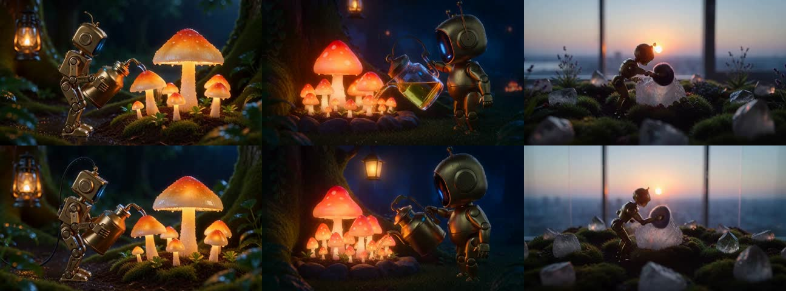

# R9700 local video benchmark

Reproducible ComfyUI workflows, prompts, measurements, and stack records for
video generation on an AMD Radeon AI PRO R9700. The repository is deliberately
numbers-first: it records the time from accepted prompt to saved artifact, the
delivered video duration, and the wall-time cost per output second.

## Automation and support

Almost all of this repository is generated and assembled automatically. If you
find an error, need information or clarification, or have a testing request,
please submit it as a [GitHub Issue](https://github.com/boxwrench/R9700/issues).
I’ll try to address issues and requests promptly.

## Baseline: process-cold/model-cold, 2026-08-12

| Lane | Prompt → saved artifact | Delivered video | Wall seconds / output second | Native workload |
|---|---:|---:|---:|---|
| MiniMax H3 Standard FP8 | **261.038 s** | **5.167 s** | **50.52** | 864×480, 124 frames, 24 fps, 20 steps |
| MiniMax H3 Turbo v4 FP8 | **80.927 s** | **5.167 s** | **15.66** | 864×480, 124 frames, 24 fps, 4 Turbo steps |
| LTX-2.5 distilled INT8 | **67.035 s** | **5.042 s** | **13.30** | 896×512, 121 frames, 24 fps, 8+3 steps |

These are absolute wall-time measurements, not headline percentages. Each lane
was one successful fresh-process/model-cold run. Linux filesystem caches and
persistent compiled-kernel caches remained warm, so “cold” here is not disk-cold.
The model-native LTX geometry differs from H3 and is disclosed rather than
silently cropped in the headline.

## Experimental dual-GPU residency

The corrected H3 dual-GPU lane keeps H3 and sampling on the R9700 and places
Qwen3-VL on an RX 7900 XT. It was consistently faster in one controlled
engineering sequence, but the decisive changed-prompt gain was **7.9%**, below
the 10% adoption threshold. Keep single-R9700 as the default; use the dual lane
for longer sessions or when lower host-RAM pressure matters.

| State | Single R9700 | Corrected dual | Gain |
|---|---:|---:|---:|
| Process/model-cold, prompt A | 80.673 s | **76.867 s** | 4.7% |
| Same prompt, new seed | 70.436 s | **68.003 s** | 3.5% |
| Changed prompt B, same seed | 75.456 s | **69.506 s** | 7.9% |

The failed first attempt is worth preserving: --disable-smart-memory caused
aggressive host offload and defeated residency. The [full dual-GPU record](docs/dual-gpu-residency.md)
includes the corrected launcher, exact workflows, normalized rows, health
checks, and resource observations.



The two generated feasibility studies and a reconciled pursuit plan are in
[the mixed-AMD H3 research synthesis](docs/research/mixed-amd-h3-research-synthesis.md).
The original documents are retained beside it, with source hashes. Their
projections are planning evidence, not measurements from this workstation.

## DeepSeek V4 Flash local inference

A separate llama.cpp/Vulkan campaign ran DeepSeek V4 Flash UD-Q4_K_XL plus the
Q8_0 DSpark drafter on the R9700 and system DDR5. The selected configuration
uses a 32,768-token context, Q8 target/draft KV caches on GPU, one slot, and 41
target MoE expert layers in system RAM. The RX 7900 XT is hidden from llama.cpp.

| Validation | Result |
|---|---:|
| Two-run mean decode | **8.14 tokens/s** |
| DSpark acceptance, final code prompt | **78.9%** |
| Long-context retrieval | **Pass at 24,603 input tokens** |
| Deterministic sanity check | **5/5** |
| R9700 allocation after full run | **32.156 GB / 34.209 GB** |

The 32K Q8 GPU-KV profile was faster than Q4 GPU KV and substantially faster
than Q8 KV in system RAM. Device isolation was essential: selecting the R9700
for the target while both GPUs remained visible caused the DSpark shared-output
tensor assertion. `GGML_VK_VISIBLE_DEVICES=1` exposed only the R9700 to both
contexts and fixed the load.

The [full DeepSeek V4 inference record](docs/deepseek-v4-flash-inference.md)
documents placement, commands, screening results, the 24.6K-token retrieval
test, limitations, and guarded crash recovery. Normalized measurements are in
[`data/experimental/deepseek-v4-flash.tsv`](data/experimental/deepseek-v4-flash.tsv),
with the compact profile matrix under [`experiments/deepseek-v4-flash/`](experiments/deepseek-v4-flash/).

## Qwen3.8-27B quantization comparison

Two Unsloth dynamic quantizations of Qwen3.8-27B were measured on the R9700
under llama.cpp/Vulkan, fully offloaded, using the model's built-in MTP head for
speculative decoding. Q4_K_XL is the selected profile for routine local serving.

| | UD-Q4_K_XL | UD-Q6_K_XL |
|---|---:|---:|
| Context size | 163,840 | 65,536 |
| Decode, ten-sample mean | **51.30 tokens/s** | **39.08 tokens/s** |
| Prefill, ten-sample mean | **705.99 tokens/s** | **700.05 tokens/s** |
| MTP draft acceptance | **71.6%** | **70.4%** |
| R9700 allocation | 29.784 GB | 30.409 GB |

Prefill is unchanged between the two, inside run-to-run spread, because prompt
processing is compute-bound. Decode falls 23.8% because it is bandwidth-bound
and Q6 weights are 1.446× larger. Draft acceptance is effectively identical, so
Q6 returns nothing through speculation. The context sizes differ by necessity:
Q6 weights leave too little VRAM for 163,840 tokens. This is a speed
measurement only — no quality or perplexity comparison was run.

Two negative results are worth the space. `--models-max` defaults to 4 and
evicts by model count rather than VRAM, so the router held two large models on
one 32 GB card, spilled weights to host RAM, and dropped decode to 3.85
tokens/s with nothing in the logs explaining it. Separately, varying only the
sampler seed between benchmark samples yields prompt-cache hits and a
meaningless prefill figure; prompts must be prefixed uniquely.

The quantization table above holds thinking disabled on both sides. The gateway
that serves this host actually sends `reasoning_effort: low`, and Q4 re-measured
in that mode decodes slightly *faster*, at 52.93 tokens/s with 74.8% draft
acceptance, most likely because chain-of-thought text is more formulaic and the
MTP head predicts it better. That is not a claim of faster answers: token rate
counts thinking tokens, and reasoning mode emits more of them before the
response begins.

The [full Qwen3.8-27B record](docs/qwen3-8-27b-quant-comparison.md) covers the
hybrid Gated DeltaNet architecture and its unusually small KV footprint, router
preset precedence, the speculative-decoding sweep, and the null results for
batch sizing, host scheduling flags, and GPU clock control. Normalized
measurements are in
[`data/experimental/qwen3-8-27b-quant.tsv`](data/experimental/qwen3-8-27b-quant.tsv),
with the harness and preset under
[`experiments/qwen3-8-27b/`](experiments/qwen3-8-27b/).

## Qwen3.8-27B runtime parameter sweep

Twenty-nine configurations were measured against the production Qwen3.8-27B
UD-Q4_K_XL profile. **None beat it.** The production point measured 50.91
tokens/s across five repeats (sd 0.22), confirming it sits on a real local
optimum rather than merely appearing fast.

| Parameter | Optimum | Result |
|---|---|---|
| `spec-draft-n-max` | **2** | Decisive; 44.46 at depth 1 and 28.41 at depth 8 |
| `spec-draft-p-min` | 0.3 | Flat 0.0–0.3, monotonic decline above |
| `ctx-size` | 163840 | Flat; free for decode |
| `ubatch-size` | 512 | Flat for decode, but 25% of prefill below 384 |

The instructive result is that acceptance rate moves *opposite* to throughput.
Draft depth 1 has the highest acceptance in the study at 0.811 and nearly the
worst decode; confidence gating at 0.8 reaches 0.886 acceptance and is 12%
slower. Acceptance is a diagnostic of the proposer, not a tuning target. The
production point's 0.7068 cannot be improved with ordinary llama.cpp knobs.

A ROCm/HIP build at the same commit was measured against Vulkan on identical
weights: prefill **+41.6%**, decode **−11.6%**. Backend choice depends on
workload shape, and this host serves short-prompt/long-answer agent traffic,
so Vulkan is retained. HIP additionally required `HIP_VISIBLE_DEVICES` to load
at all — the same device-isolation requirement already recorded for Vulkan in
the DeepSeek campaign.

The [full parameter sweep record](docs/qwen3-8-27b-parameter-sweep.md) includes
per-stage tables, positional draft-acceptance survival curves for depths 1
through 8, the metric definitions, the HIP backtrace, and limitations.
Normalized measurements are in
[`data/experimental/qwen3-8-27b-sweep.tsv`](data/experimental/qwen3-8-27b-sweep.tsv).

## Qwen3.8-27B KV-cache precision and speculative-decoding equivalence

Quantizing the KV cache does not buy throughput on this card, but it buys a lot
of memory. Against f16, `q8_0` frees 4.69 GiB for 2.3% decode and `q4_0` frees
7.19 GiB — 21% of the card — for 2.6%. Draft acceptance is flat to three digits
across all three, so KV precision does not touch the proposer. KV precision is
closed as a throughput lever and retained as a memory lever.

The correctness gate in that experiment surfaced a larger finding. MTP
speculative decoding changes greedy output relative to ordinary decode, while
n-gram speculation on the same target is bit-identical. The cause is neither the
acceptance rule nor speculative batch shape: selecting a model-based draft type
sets `n_rs_seq = n_max`, which routes Gated DeltaNet through a recurrent-state
snapshot kernel for every token. Forcing that configuration with no drafter at
all reproduces the divergence.

The [running experiment log](docs/qwen3-8-27b-experiment-log.md) indexes every
Qwen3.8-27B experiment in this campaign, including two retracted conclusions and
the controls that overturned them. KV measurements are in
[`data/experimental/qwen3-8-27b-kv-cache.tsv`](data/experimental/qwen3-8-27b-kv-cache.tsv).

## Qwen3.8-27B MTP verification and proposer optimization

A multi-stage optimization campaign targeted the 46.3 ms end-to-end MTP round (41.3 ms verification, 5.06 ms proposer forward) on R9700/Vulkan.

| Phase / Investigation | Strategy & Scope | Measured Result | Status |
|---|---|---|---|
| **IQ4_XS Dequant Reuse** | Eliminating redundant SPIR-V dequantization in FFN down | Kernel −2.4% (−0.18 ms), in-graph wall time flat (<0.2 ms) | Closed |
| **IQ4_XS Occupancy Variant** | Halving rows-per-workgroup (`ROWS=2`) for 24 subgroups/SIMD | +3.6% kernel regression from doubled dispatch overhead | Closed |
| **Tiny-N MUL_MAT + ADD Fusion** | Generalizing `mm_add_ok` predicate to multi-column $N=2..8$ | Eliminates 80 dispatches (−277 µs), but offset by +219 µs bias fetch | Closed |
| **MTP Proposer Decomposition** | Full kernel & tensor breakdown across 556 rounds | Proposer scales linearly at 2.70 ms/token (5.24 ms/round at depth 2) | Complete |

The proposer decomposition revealed that **69.2% of proposer GPU execution** (0.99 ms / step, 1.92 ms / round) is concentrated in the single 1.04 GB `output.weight` full-vocabulary LM Head (`Q6_K`, $M=248320, K=5120$), while the entire 8-matmul transformer block takes only 0.32 ms. Proposer execution scales strictly linearly with draft depth (depth 1: 2.94 ms, depth 2: 5.61 ms, depth 3: 7.54 ms, depth 4: 10.09 ms).

Normalized proposer measurements are in
[`data/experimental/qwen3-8-27b-mtp-proposer.tsv`](data/experimental/qwen3-8-27b-mtp-proposer.tsv),
pipeline and path metrics are in
[`data/experimental/qwen3-8-27b-iq4xs-pipeline-stats.tsv`](data/experimental/qwen3-8-27b-iq4xs-pipeline-stats.tsv) and
[`data/experimental/qwen3-8-27b-iq4xs-path.tsv`](data/experimental/qwen3-8-27b-iq4xs-path.tsv),
with full narrative logs in [`docs/qwen3-8-27b-experiment-log.md`](docs/qwen3-8-27b-experiment-log.md).

## Hardware and backend

- AMD Radeon AI PRO R9700, 32 GB VRAM, `gfx1201`
- AMD Ryzen 7 9800X3D, 8 cores / 16 threads; 188 GiB host RAM
- Ubuntu 24.04.4 LTS; Linux `6.17.0-42-generic`
- ROCm 7.2.1 / HIP 7.2.53211; PyTorch `2.9.1+rocm7.2.1.gitff65f5bc`
- Triton `3.5.1+rocm7.2.1.gita272dfa8`; comfy-kitchen `0.2.30`
- ComfyUI `0.32.0`, commit `c2bcbecd82ec5ae66594340b395c24ef0217b238`

The full stack and launch behavior are in
[`docs/hardware-software.md`](docs/hardware-software.md).

## Visual examples

These poster frames are extracted from the canonical local artifacts. Click any
frame to open the GitHub Pages gallery with the full video:

<table>
<tr>
<td><a href="https://boxwrench.github.io/R9700/"></a><br><sub>H3 Standard FP8 — 261.038 s → 5.167 s</sub></td>
<td><a href="https://boxwrench.github.io/R9700/"></a><br><sub>H3 Turbo v4 FP8 — 80.927 s → 5.167 s</sub></td>
<td><a href="https://boxwrench.github.io/R9700/"></a><br><sub>LTX-2.5 INT8 — 67.035 s → 5.042 s</sub></td>
</tr>
</table>

The gallery source is [`docs/index.html`](docs/index.html). Its MP4 sources are
GitHub Release assets, keeping video binaries out of ordinary Git history. See
[`docs/publishing-video.md`](docs/publishing-video.md) for the one-time Pages
and release setup.

## Start here

1. Read [`docs/methodology.md`](docs/methodology.md) for the timing boundary and
   the cold-state definition.
2. Inspect the normalized measurements in
   [`data/results.tsv`](data/results.tsv) and the field definitions in
   [`docs/data-schema.md`](docs/data-schema.md).
3. Load the exact JSON workflows under
   [`workflows/`](workflows/). Their SHA-256 values are checked by
   [`scripts/verify.py`](scripts/verify.py).
4. Use the neutral prompt in
   [`prompts/neutral-brass-robot.txt`](prompts/neutral-brass-robot.txt), or
   choose a separate I2V/T2V card from the
   [`Boxwrench v1 prompt suite`](prompts/boxwrench-v1/README.md).

Run the local checks with:

```bash
python3 scripts/verify.py
```

## Scope and safety

Model weights, caches, environments, credentials, and video binaries are not
tracked. Canonical artifact paths and SHA-256 values are recorded in
[`data/artifacts.tsv`](data/artifacts.tsv) so another operator can validate a
local copy without inflating normal Git history. The social-post directory
contains text records only; the original MP4 attachments are intentionally
omitted.

No repository license has been selected yet. Model and prompt-asset licensing
must be checked at their upstream sources. Private authorization correspondence
is not included. Do not treat a workflow or a measurement as permission to
redistribute model weights.

## Public source links

- [ComfyUI](https://github.com/Comfy-Org/ComfyUI)
- [MiniMax H3 on Hugging Face](https://huggingface.co/Comfy-Org/MiniMax-H3)
- [MiniMax H3 Turbo LoRA](https://huggingface.co/larryvrh/MiniMax-H3-Turbo-Lora)
- [LTX-2.5 on Hugging Face](https://huggingface.co/Lightricks/LTX-2.5)
